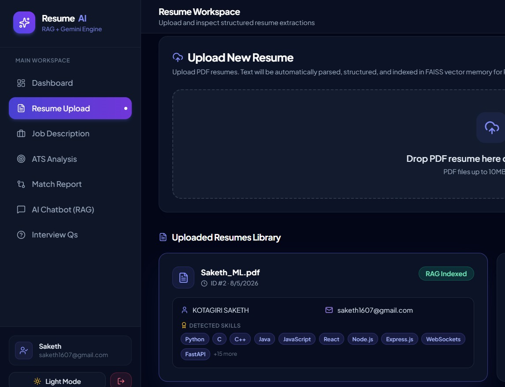
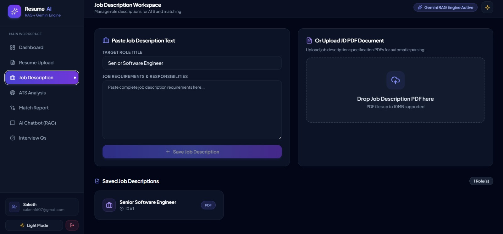
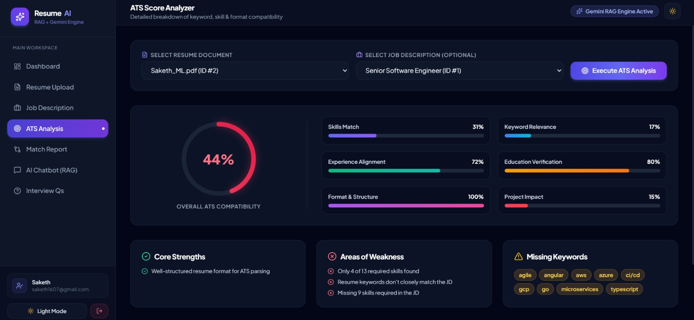
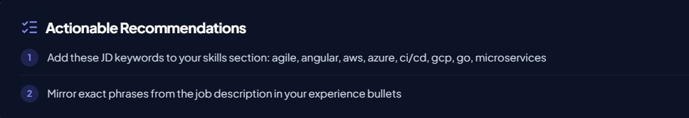
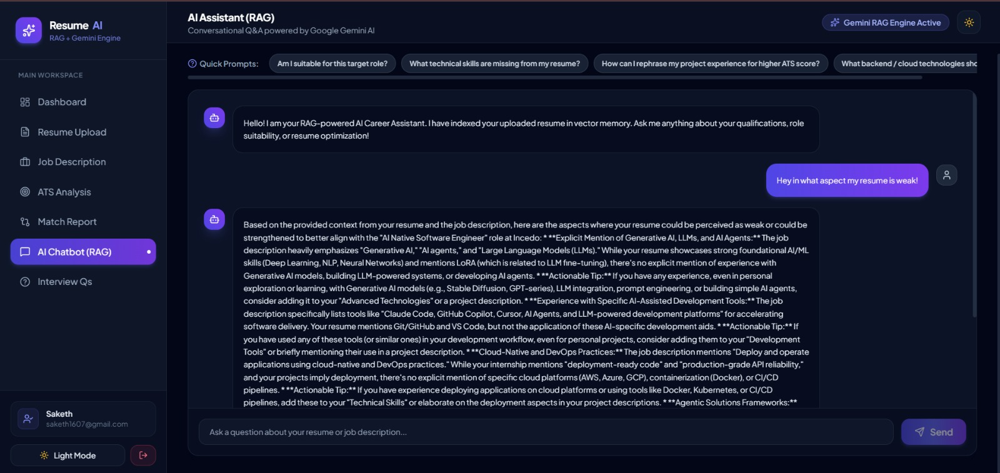
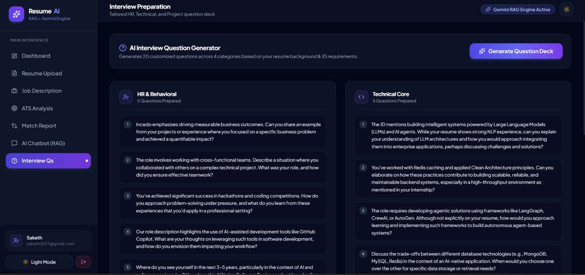
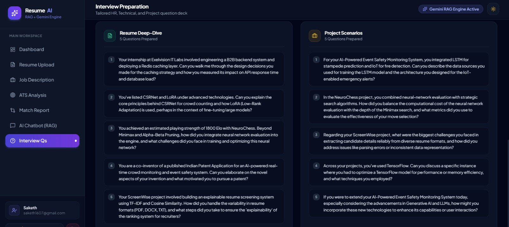

# AI Resume Analyzer RAG 🚀

An enterprise-grade, AI-powered Resume Intelligence & Career Optimization Platform built with **Retrieval-Augmented Generation (RAG)**, **Google Gemini 2.0**, **LangChain**, **Supabase Vector Store (pgvector)**, **FastAPI**, and a **React 18 + Tailwind CSS + Framer Motion** frontend.


---


## 🌟 Key Features

- 📄 **Resume PDF Parsing & Vector Indexing**  
  Upload PDF resumes with automated text extraction (via PyMuPDF). Parses contact details, experience, and skills, then chunks and generates vector embeddings stored in **Supabase pgvector**.

- 🎯 **Multi-Dimensional ATS Scoring Engine**  
  Evaluates resumes against industry benchmarks across 6 key metrics: *Skills Match*, *Keyword Relevance*, *Experience Alignment*, *Education Verification*, *Format & Structure*, and *Project Impact*. Generates strengths, weaknesses, missing keywords, and actionable recommendations.

- 💼 **Job Description Comparison & Role Fit**  
  Upload JD PDFs or paste raw text. Calculates exact semantic fit percentage, highlights matching competencies, identifies missing technologies, and builds a custom improvement roadmap.

- 💬 **RAG-Powered AI Career Chatbot**  
  Contextual, non-hallucinated career advisor powered by LangChain and Gemini 2.0. Retrieves relevant chunks from vector memory to answer candidate questions, rephrase bullet points, and offer resume advice.

- ⚡ **AI Interview Question Generator**  
  Generates 20 custom interview questions tailored to the candidate's resume and target JD across 4 distinct categories:
  - 👤 **HR & Behavioral**
  - 💻 **Technical Core**
  - 🔍 **Resume Deep-Dive**
  - 🚀 **Project Scenarios**


- 📊 **Interactive Analytics Dashboard**  
  Visualizes score progression over time with **Chart.js** line graphs, animated **radial SVG score gauges**, top extracted skills clouds, and real-time gap alerts.

- 🌓 **Sleek Light & Dark Dual Theme**  
  Clean Pearl White light mode & Midnight Navy Glass dark mode with fluid CSS transitions, Tailwind design tokens, and persistent theme toggling.

---

## 🛠️ Architecture & Tech Stack

```
AI-Resume-Analyzer-RAG/
├── backend/                   # FastAPI Python REST API & LangChain RAG Core
│   ├── app/
│   │   ├── api/               # API Router Endpoints (auth, resume, jd, analyze, chat, generate)
│   │   ├── database.py        # SQLAlchemy Async SQLite Database Connection
│   │   ├── rag/               # LangChain Chains, Prompts & Supabase Vectorstore Manager
│   │   ├── services/          # Gemini 2.0 Integration & PDF Parsing Services
│   └── requirements.txt       # Python dependencies
└── frontend/                  # React 18 SPA (Vite + Tailwind CSS)
    ├── src/
    │   ├── components/        # Layout, Sidebar, Dropzone, ScoreGauge
    │   ├── context/           # AuthContext & ThemeContext
    │   ├── pages/             # Home, Dashboard, ResumeUpload, JDUpload, ATS, Match, Chat, Interview
    │   └── services/          # Axios API Client
```

### Technology Matrix

| Layer | Technologies Used |
| :--- | :--- |
| **Frontend Framework** | React 18, Vite, React Router v7 |
| **Styling & UI** | Tailwind CSS v3, Framer Motion, Lucide Icons, Plus Jakarta Sans |
| **Data Visualization**| Chart.js, React-Chartjs-2, Custom SVG Gauges |
| **Backend REST API** | FastAPI, Uvicorn, Pydantic v2, Loguru |
| **LLM & Embeddings** | Google Gemini 2.0 (`gemini-2.0-flash-lite`), `models/embedding-001` |
| **RAG & Vector DB** | LangChain, Supabase (`pgvector`), PyMuPDF (fitz) |
| **Relational DB** | SQLite, SQLAlchemy 2.0 (Async), aiosqlite |
| **Auth & Security** | JWT (python-jose), Passlib (Bcrypt), CORS Middleware |

---

## 🚀 Quick Start Guide

### Prerequisites
- **Python 3.10+** installed
- **Node.js 18+** installed
- **Google Gemini API Key** ([Get key here](https://aistudio.google.com/))
- **Supabase Account** with `pgvector` enabled ([Create Supabase Project](https://supabase.com/))

---

### 1. Supabase Database Setup

Run the following SQL script in your **Supabase SQL Editor** to create the vector storage schema:

```sql
-- Enable vector extension
CREATE EXTENSION IF NOT EXISTS vector;

-- Create documents table
CREATE TABLE IF NOT EXISTS documents (
  id UUID PRIMARY KEY DEFAULT gen_random_uuid(),
  content TEXT,
  metadata JSONB,
  embedding VECTOR(768)
);

-- Create match_documents search function
CREATE OR REPLACE FUNCTION match_documents (
  query_embedding VECTOR(768),
  match_count INT DEFAULT 5,
  filter JSONB DEFAULT '{}'
)
RETURNS TABLE (
  id UUID,
  content TEXT,
  metadata JSONB,
  similarity FLOAT
)
LANGUAGE plpgsql
AS $$
BEGIN
  RETURN QUERY
  SELECT
    documents.id,
    documents.content,
    documents.metadata,
    1 - (documents.embedding <=> query_embedding) AS similarity
  FROM documents
  WHERE documents.metadata @> filter
  ORDER BY documents.embedding <=> query_embedding
  LIMIT match_count;
END;
$$;
```

---

### 2. Backend Setup

1. **Navigate to the backend folder**:
   ```bash
   cd backend
   ```

2. **Create and activate virtual environment**:
   ```bash
   # Windows
   python -m venv venv
   .\venv\Scripts\activate

   # Linux/macOS
   python3 -m venv venv
   source venv/bin/activate
   ```

3. **Install dependencies**:
   ```bash
   pip install -r requirements.txt
   ```

4. **Configure `.env` file**:
   Copy `.env.example` to `.env` and insert your credentials:
   ```env
   APP_NAME=AI Resume Analyzer
   SECRET_KEY=your_super_secret_jwt_key
   DATABASE_URL=sqlite+aiosqlite:///./resume_analyzer.db

   # Gemini API Credentials
   GEMINI_API_KEY=your_gemini_api_key_here
   GEMINI_MODEL=gemini-2.0-flash-lite
   EMBEDDING_MODEL=models/embedding-001

   # Supabase Vector Store
   SUPABASE_URL=https://your-project.supabase.co
   SUPABASE_SERVICE_ROLE_KEY=your_supabase_service_role_key
   SUPABASE_TABLE_NAME=documents
   SUPABASE_QUERY_NAME=match_documents

   CORS_ORIGINS=http://localhost:5173
   ```

5. **Start FastAPI Backend Server**:
   ```bash
   uvicorn app.main:app --reload --port 8000
   ```
   The backend API will be available at `http://localhost:8000` (Interactive Swagger Docs at `http://localhost:8000/docs`).

---

### 3. Frontend Setup

1. **Navigate to the frontend folder**:
   ```bash
   cd ../frontend
   ```

2. **Install node dependencies**:
   ```bash
   npm install
   ```

3. **Start Vite Development Server**:
   ```bash
   npm run dev
   ```
   The Web UI will be accessible at `http://localhost:5173`.

---

## 📡 Key API Endpoints Summary

| Endpoint | Method | Description |
| :--- | :--- | :--- |
| `/api/auth/register` | `POST` | Register a new candidate account |
| `/api/auth/login` | `POST` | Authenticate & retrieve JWT token |
| `/api/resume/upload` | `POST` | Upload PDF resume & index in Supabase vector store |
| `/api/resume/list` | `GET` | List candidate's uploaded resumes |
| `/api/jd/upload-text` | `POST` | Save raw Job Description text |
| `/api/jd/upload` | `POST` | Upload Job Description PDF |
| `/api/analyze/ats-score` | `POST` | Calculate comprehensive 6-metric ATS score |
| `/api/analyze/match` | `POST` | Compare resume against specific JD |
| `/api/chat/query` | `POST` | Contextual RAG query against candidate vector memory |
| `/api/generate/interview-questions` | `POST` | Generate 20 category-divided interview questions |
| `/api/dashboard/stats` | `GET` | Retrieve analytics stats and historical score trajectory |

---

## 🛡️ License

This project is open-source under the [MIT License](LICENSE).

---

Developed with ❤️ by **Priyanshu Patidar**.
