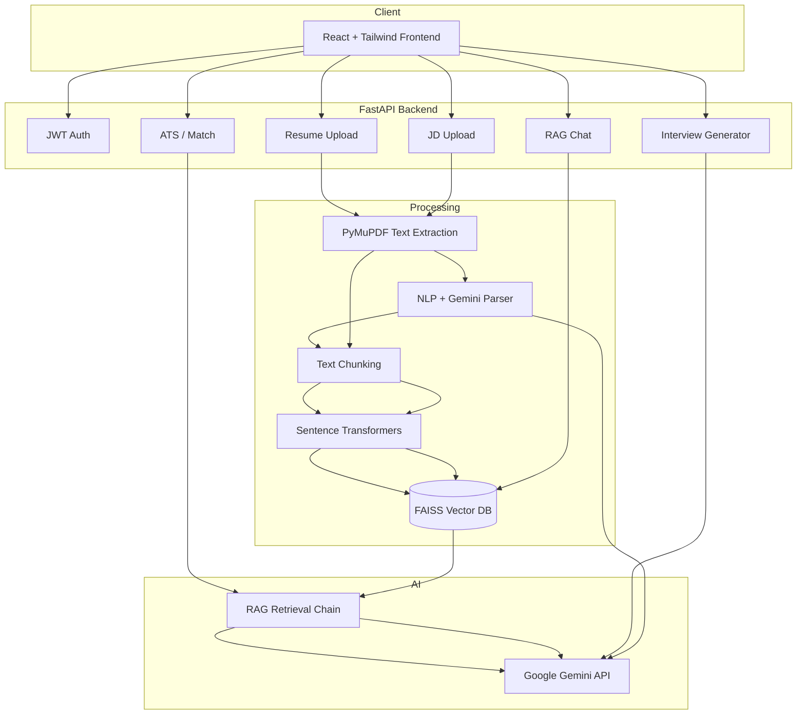

# Architecture

## System Overview



## Data Flow

1. **Upload** – User uploads resume/JD PDF or pastes JD text.
2. **Extract** – PyMuPDF extracts raw text.
3. **Parse** – Regex/NLP + Gemini enrich structured fields (skills, experience, etc.).
4. **Index** – LangChain splits text, Sentence Transformers embed chunks, FAISS stores vectors per user document.
5. **Analyze** – ATS/Match prompts sent to Gemini with resume/JD context.
6. **Chat** – User question → FAISS similarity search → context + conversation memory → Gemini response.

## Folder Structure

```
backend/app/
├── api/          # REST routers
├── services/     # Business logic
├── rag/          # Embeddings, FAISS, chains, prompts
├── models/       # SQLAlchemy + Pydantic schemas
└── middleware/   # Logging

frontend/src/
├── pages/        # Route pages
├── components/   # Reusable UI
├── context/      # Auth & theme
├── hooks/        # Shared hooks
└── services/     # Axios API client
```

## Security

- JWT bearer tokens on protected routes
- Per-user file isolation under `uploads/{user_id}/`
- CORS restricted to configured origins
- API keys loaded from environment only

## Deployment

| Component | Platform |
|-----------|----------|
| Frontend  | Vercel   |
| Backend   | Render / Railway |
| Vectors   | Local FAISS (per-instance disk) |
